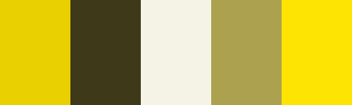

# Designing With Colours

## Types of colour schemes

There are three main types of tradional colour schemes (monochrome, analogous, complementary)

A hue is one of the main properties of a color, defined technically, as "the degree to which a stimulus can be described as similar to or different from stimuli that are described as red, green, blue, and yellow".

## Monochrome
Monochromatic color schemes are made up of different tones, shades and tints. These are the easiest color schemes to create, because they’re all taken from the same hue, making it harder to create an ugly scheme.
 
 
 
 

## analogous

Analogous color schemes are one of easiest colour schemes to create. they are created by using three colors that are next to each other on the 12-spoke color wheel. analogous color schemes generally all have the same chroma level, but by using tones, shades and tints we can add interest to these schemes and adapt them to designing websites.

 
 

## complementary
